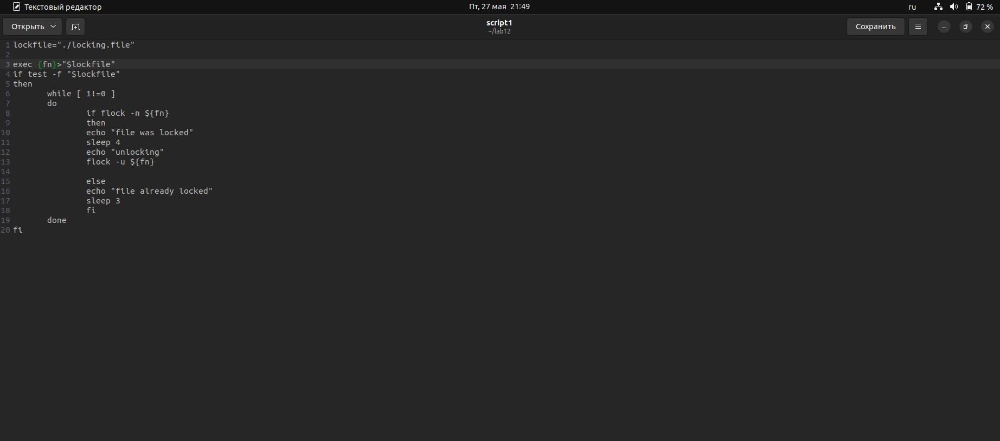
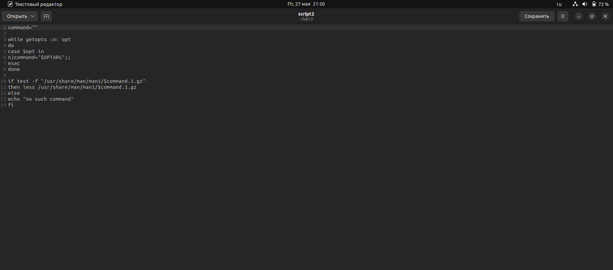
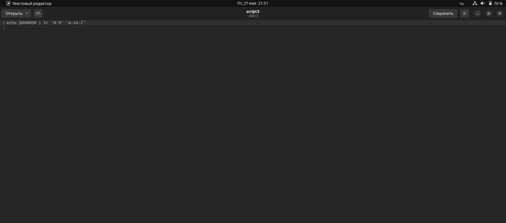

---
## Front matter
lang: ru-RU
title: Лабораторная работа №12
author: Баротов Комрон НБИ-01
institute: |
	\inst{1}RUDN University, Moscow, Russian Federation
	
date: 27.05.2022

## Formatting
toc: false
slide_level: 2
theme: metropolis
header-includes: 
 - \metroset{progressbar=frametitle,sectionpage=progressbar,numbering=fraction}
 - '\makeatletter'
 - '\beamer@ignorenonframefalse'
 - '\makeatother'
aspectratio: 43
section-titles: true
---

#   Программирование в командном процессоре OC UNIX. Расширенное программирование

## Цель работы

Изучим основы программирования в оболочке ОС UNIX. Научимс писать более
сложные командные файлы с использованием логических управляющих конструкций
и циклов.

## Выполнение лабораторной работы 

1. Скрипт 1 (рис.1)

{ #fig:001 width=90% }

##

2. Скрипт 2 (рис.2)

{ #fig:002 width=90% }

##

3. Скрипт 3 (рис.3)

{ #fig:003 width=90% }

##

## Вывод

В данной работе мы научились писать более сложные командные файлы с использованием логических управляющих конструкций
и циклов.

## {.standout}

Wer's nicht glaubt, bezahlt einen Taler
